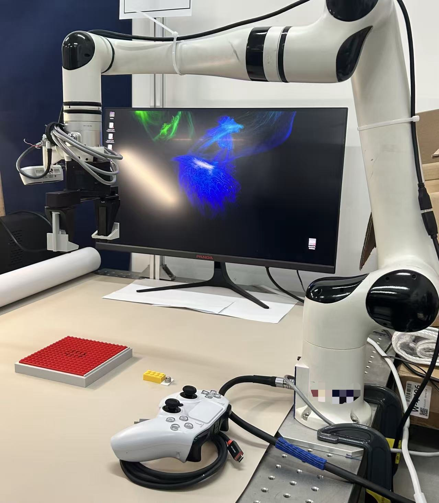

# Joy2Robot-RM63

ROS 2 Xbox teleoperation, automatic pickup, hybrid force control, and
demonstration recording for the RealMan RM63 robot arm.

<p align="center">
  
</p>

## Safety

This package sends commands directly to the robot arm. Do not run another
teleop, policy process, `run_task.py`, or any other arm-command source at the
same time.

Keep the hardware emergency stop accessible. Software stop messages and driver
acknowledgements do not prove that the robot has physically stopped.

The automatic pickup deliberately uses the gripper trajectory values `0.1`
followed by `0.014`, matching the original task trajectory. Those values can
conflict with the usual open/closed convention of the deployed gripper bridge.
Verify the physical gripper direction under supervision before attempting a
pickup. Also verify the fixed pickup position, fixture clearance, tool
orientation, and force-sensor reading in free space.

## What It Does

The `xbox_xyz_teleop` node manages the complete manipulation workflow:

1. Wait for fresh joystick, arm-pose, force, and gripper feedback.
2. Press `START` to execute an automatic pickup and transfer.
3. Verify that the tool center point reached the configured pre-insertion pose.
4. Release `RB`, neutralize the controller, and press `RB` to hand control to
   the operator and begin recording.
5. Use full Cartesian teleoperation before contact.
6. After contact, use operator-controlled X/Y motion with automatic Z-force
   control.
7. Release `RB` to pause safely, or label the demonstration with `A`, `X`, or
   `B`.

This package does not run a learned policy or online learning.

## Requirements

- Ubuntu with ROS 2 Humble
- RealMan RM63 ROS driver and `rm_ros_interfaces`
- `ros2_hkv_gripper` and the robot-end gripper bridge
- ROS 2 `joy` package and an Xbox-compatible controller
- RealSense D435i color camera publisher
- Python packages: NumPy, SciPy, and OpenCV

The normal robot bringup must provide:

- `/rm_driver/udp_arm_position`
- `/rm_driver/udp_six_zero_force`
- `/rm_driver/udp_arm_coordinate`
- `/gripper_registers`
- `/gripper_controller/follow_joint_trajectory`
- `/realman_gripper_bridge/get_parameters`
- Motion-result and stop-result topics from the RM63 driver

## Build

The project is a standalone colcon workspace containing one ROS package. Source
the existing RM63 workspace first so its custom message packages are available:

```bash
source /opt/ros/humble/setup.bash
source /home/mahua/ros2_ws/install/setup.bash
cd /home/mahua/Joy2Robot-RM63
PYTHONNOUSERSITE=1 colcon build \
  --packages-select rml_joy_teleop \
  --symlink-install
source install/setup.bash
```

Source all three setup files in each new terminal:

```bash
source /opt/ros/humble/setup.bash
source /home/mahua/ros2_ws/install/setup.bash
source /home/mahua/Joy2Robot-RM63/install/setup.bash
```

## Run

Start the supervised RM63 driver and gripper bridge using the configuration for
your robot.

Start the joystick with an autorepeat heartbeat. The teleop watchdog requires a
fresh joystick message within 250 ms:

```bash
ros2 run joy joy_node --ros-args -p autorepeat_rate:=30.0
```

If a D435i color publisher is not already running:

```bash
ros2 launch realsense2_camera rs_launch.py \
  camera_namespace:=cameras camera_name:=d435i \
  enable_color:=true enable_depth:=false \
  enable_infra:=false enable_infra1:=false enable_infra2:=false \
  rgb_camera.color_profile:=640,480,30
```

Select the configured camera serial number when more than one RealSense camera
is attached. Close `realsense-viewer` before starting the ROS camera driver.

Run the complete workflow:

```bash
ros2 run rml_joy_teleop xbox_xyz_teleop
```

The equivalent command with the main defaults made explicit is:

```bash
ros2 run rml_joy_teleop xbox_xyz_teleop --ros-args \
  -p auto_pick_on_start:=true \
  -p record_demonstrations:=true \
  -p record_rate_hz:=15.0 \
  -p 'grab_ee_base_mm:=[281.0, -7.711, 158.0]' \
  -p pregrab_height:=0.03 \
  -p record_camera_topic:=/cameras/d435i/color/image_raw \
  -p record_dataset_root:="$HOME/vla_datasets/rm63_teleop"
```

For manual operation without automatic pickup or demonstration recording:

```bash
ros2 run rml_joy_teleop xbox_xyz_teleop --ros-args \
  -p auto_pick_on_start:=false \
  -p record_demonstrations:=false
```

Recording requires automatic pickup. A configuration that enables recording
while disabling pickup is rejected.

## Controller Mapping

### Before Contact

| Control | Action |
| --- | --- |
| `START` | Start automatic pickup, or arm manual mode when pickup is disabled |
| Hold `RB` | Deadman switch required for arm movement |
| Left stick up/down | Translate X |
| Left stick left/right | Translate Y |
| Right stick up/down | Translate Z |
| D-pad left/right | Yaw |
| D-pad up/down | Pitch |
| `RT` / `LT` | Positive / negative roll |
| `HOME` | Set the target to the predefined home pose |
| `Y` | Fully open the gripper |
| `X` | Move the gripper to the half-open position |
| `A` | Close the gripper |
| `B` | Cancel, stop, or disarm |

### After Contact

Only left-stick X/Y movement remains under operator control. The controller
holds the Z/orientation reference and commands insertion force automatically.
Releasing `RB` requests both arm and hybrid-force stops and pauses recording.
After acknowledgements arrive, neutralize the controller and press `RB` again
to start a new recording segment.

### During Recording

| Button | Outcome |
| --- | --- |
| `A` | Stop and label success |
| `X` | Stop and label failure |
| `B` | Stop and discard this attempt |

Outcome priority is `B`, then `X`, then `A`. Manual gripper commands and
`HOME` are disabled while a recording is active or paused. There is no
automatic retreat or gripper release after cancellation or an outcome.

## Automatic Pickup

The pickup sequence is nonblocking and accepts only fresh command results:

1. Send the first gripper trajectory target (`0.1`).
2. MoveJ_P to 30 mm above the configured grab flange position.
3. MoveL down to the grab position.
4. Capture fresh tactile and gripper-register baselines.
5. Send the second gripper trajectory target (`0.014`).
6. Confirm the grasp using two consecutive fresh tactile changes of at least
   20, or two register readings within 20 counts of register 860.
7. Wait 1.5 seconds, then lift vertically to TCP Z = 0.050 m.
8. Transfer to TCP XY = `(0.430, -0.010)` m.
9. Descend to TCP Z = `0.03125` m.
10. Verify the measured TCP is within 3 mm of the target.

The sequence preserves the measured starting orientation and uses a rotated
TCP offset of `(0, 0, 0.15875)` m. Flange targets are restricted to X/Y
`[-0.8, 0.8]` m and Z `[0.02, 1.0]` m. Pickup commands use speed 10 and a
90-second timeout.

## Teleoperation and Force Control

Before contact, the node continuously publishes pose targets at 100 Hz on
`/rm_driver/movep_canfd_cmd`. The target is seeded from measured arm feedback
before motion, preventing a jump to an arbitrary startup pose.

Contact detection uses `/rm_driver/udp_six_zero_force`:

- Compression is `-raw_fz`.
- An exponential moving average uses 0.25 new and 0.75 previous data.
- Contact requires three consecutive distinct filtered samples at or above
  2 N.
- Contact remains active across operator pauses.

After contact, the node starts acknowledged hybrid force/position control and
publishes at 50 Hz:

```text
compression_command = clamp(7 + 0.5 * (7 - max(0, filtered_compression)), 0, 10)
base_frame_Fz_command = -compression_command
Z speed limit = 0.002 m/s
hard stop = 15 N filtered compression
```

Hybrid mode uses X/Y position control, Z force control, and fixed orientation.
A 15 N filtered compression fault is latched and requires a process restart.

## ROS Interfaces

Important inputs:

| Topic or service | Purpose |
| --- | --- |
| `/joy` | Controller axes and buttons |
| `/rm_driver/udp_arm_position` | Measured flange pose |
| `/rm_driver/udp_six_zero_force` | Six-axis force/torque feedback |
| `/rm_driver/udp_arm_coordinate` | Wrench coordinate identifier |
| `/gripper_registers` | Gripper position and fingertip tactile values |
| `/cameras/d435i/color/image_raw` | Recording image |
| `/realman_gripper_bridge/get_parameters` | Deployed gripper calibration |

Important outputs:

| Topic or action | Purpose |
| --- | --- |
| `/rm_driver/movep_canfd_cmd` | 100 Hz Cartesian target stream |
| `/rm_driver/movej_p_cmd` | Pickup approach command |
| `/rm_driver/movel_cmd` | Pickup linear motions |
| `/rm_driver/force_position_move_cmd` | 50 Hz hybrid command stream |
| `/rm_driver/start_force_position_move_cmd` | Start hybrid mode |
| `/rm_driver/stop_force_position_move_cmd` | Stop hybrid mode |
| `/rm_driver/move_stop_cmd` | Stop ordinary arm motion |
| `/gripper_controller/follow_joint_trajectory` | Automatic pickup gripper action |
| `/gripper/set_position_cmd` | Manual robot-end gripper command |

Pose, force, joystick, target, camera, coordinate, and gripper feedback are
checked for freshness. Missing or failed stop acknowledgements and unresolved
action results latch a fault that requires restarting the process.

## Demonstration Recording

Recording begins at the verified pre-insertion handoff, after a neutral
controller state and a fresh `RB` press. It runs independently at 15 Hz while
position commands continue at 100 Hz or hybrid commands at 50 Hz.

Each observation contains a 128x128 lossless RGB PNG and a 19-value state:

```text
0:6    TCP x,y,z,rx,ry,rz       metres, extrinsic XYZ Euler radians
6:12   TCP vx,vy,vz,wx,wy,wz    metres/s, radians/s
12:15  raw Fx,Fy,Fz             driver-reported coordinate
15:18  raw Mx,My,Mz             driver-reported coordinate/origin
18     measured gripper joint position
```

TCP pose and velocity are calculated from measured flange feedback and the
rotated tool offset. Angular velocity uses quaternion differences. Force and
torque values are stored without rotation or sign changes. Gripper state comes
from measured register feedback using the deployed bridge calibration; a
commanded gripper position is never substituted.

Actions are the accumulated published X/Y target displacements between
observations. Z or rotation input marks that interval as incompatible with an
XY-only policy. Automatic hybrid Z movement is not recorded as an operator
action.

Releasing `RB` creates a segment boundary. Transitions are never constructed
across pauses, and missed recording slots are skipped rather than filled with
duplicate images.

## Dataset Layout

The default root is:

```text
~/vla_datasets/rm63_teleop
```

Each attempt begins in a uniquely named `staging/` directory. On completion it
is atomically moved to:

- `success/`
- `failure/`
- `incomplete/`

A discarded attempt removes its staged frames and leaves a small JSON record
under `cancelled/`.

An episode contains:

```text
metadata.json
frames.jsonl
events.jsonl
outcome.json
images/000000.png
images/000001.png
...
```

Only a valid final success transition receives reward 1. Failures receive zero
reward. Paused outcomes remain episode labels and do not create artificial
terminal transitions.

Load compatible transitions after sourcing this package:

```python
from rml_joy_teleop.demo_loader import load_transitions

transitions = list(
    load_transitions("/absolute/path/to/success/attempt")
)
```

The loader returns HIL-SERL-style observation, action, next-observation,
reward, mask, terminal, truncation, outcome, timing, and segment fields. A
robot-specific adapter is still required before using these episodes for a
particular training stack.

After stopping every recorder process, recover interrupted staging attempts:

```bash
/usr/bin/python3 -c \
  'from rml_joy_teleop.demonstration import recover_staging; print(recover_staging("~/vla_datasets/rm63_teleop"))'
```

Do not run recovery while a recorder is active.

## Tests

The test suite uses real ROS message definitions with mocked nodes, publishers,
subscriptions, timers, actions, and services. It does not start robot hardware:

```bash
source /opt/ros/humble/setup.bash
source /home/mahua/ros2_ws/install/setup.bash
cd /home/mahua/Joy2Robot-RM63
PYTHONPATH="$PWD:$PYTHONPATH" \
  PYTEST_DISABLE_PLUGIN_AUTOLOAD=1 \
  /usr/bin/python3 -m pytest -q test
```

Mock tests cannot establish physical gripper direction, fixture clearance,
driver frame correctness, contact validity, real-time performance, or physical
standstill. Those checks must be completed during a supervised hardware
rollout.

## License

Apache License 2.0. See [LICENSE](LICENSE).
